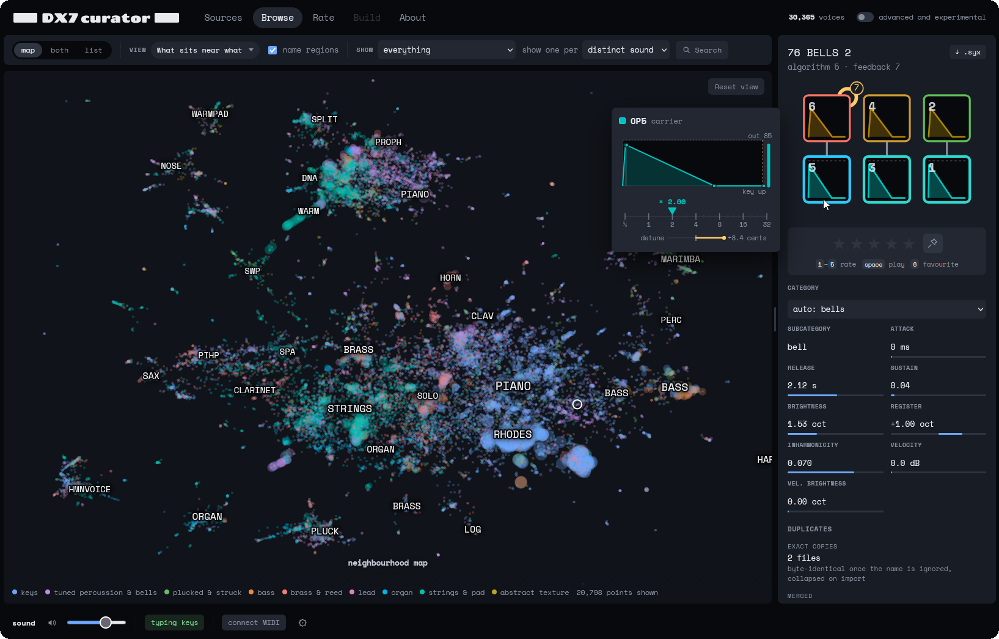

# DX7 curator

**<https://groundstation1.github.io/dx7curation/>**



Tens of thousands of free Yamaha DX7 patches exist. A synth holds 128. This is a
browser app for closing that gap. It renders every voice, measures it, and drops
the duplicates. What survives is drawn as a map where patches that sound alike
sit together, so you rate one per group instead of all of them. Out come four
32-voice banks, ordered so that neighbouring slots sound adjacent.

Nothing leaves your machine: the patches, the measurements and your ratings live
in IndexedDB.

```bash
npm install
npm run dev
```
